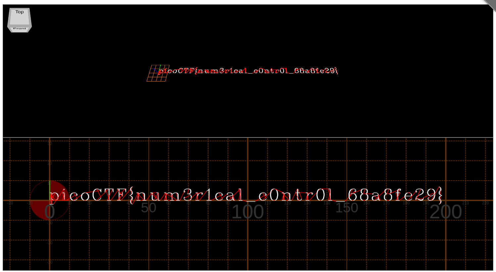

To solve this challenge, I first executed the "nc" command as per instructions, where I got the whole output to my clipboard.

Then, as I had no clues, I opened the Hint: * "What language does a CNC Machine speak?" * 

After googling for a minute, the answer is "G-Code". So I started looking for: "G-Code to English", and tried to translate the code through this website [GCode Translator](https://gorest.co.in/tools/gcode-translator.html), but it merely output some sentences like below:

`G1
Linear interpolation

X0.8276
Absolute or incremental position of X axis. Also defines dwell time on some machines (instead of "P" or "U").

Y-1.9310
Absolute or incremental position of Y axis`

Seems there was no entry with "pico" on the text, so this was a dead end. Then, I figured, why not check what it draws?

I went to this website: [WebGCode](https://nraynaud.github.io/webgcode/) and gave it the same output, where the output was as follows:

* FLAG: picoCTF{num3r1cal_c0ntr0l_68a8fe29} * 

